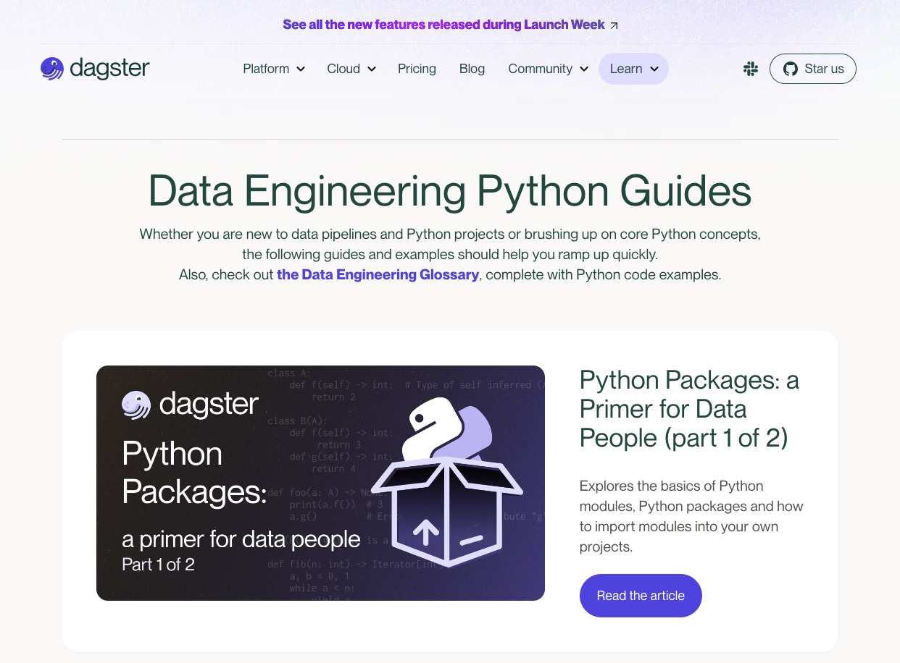

I have experience in technical writing and working with cross-functional teams to create high-quality blog posts and well-researched longform pieces. I have also conducted engaging technical interviews with data scientists and their teams at organisations such as the Rockefeller Foundation, World Bank, German Ministry of Health, UNICEF, City of London AI Lab, and AI Sweden.

My articles frequently rank highly on Google search for common keywords, in part due to my comprehensive research and careful writing process. I enjoy breaking down complex technical concepts for both beginners and advanced learners, and achieve success from being able to empathise what learners might want to know, and how they can learn best, about a new framework, enterprise tool, or platform. 

I'm always interested to hear about new projects. To collaborate, get in touch with me at elliotjgunn at gmail.com or on LinkedIn.

# Specialisation # 
My specialities include: data science, data engineering, machine learning, beginner-intermediate programming concepts, analytics, big data, econometrics, research design, enterprise data tooling, and the modern data infrastructure. 

I have a working knowledge of popular data science tools and libraries including: scikit-learn, TensorFlow/Keras, Spark, Dask, Python, SQL, Stata, and end-to-end deployment. 

# Get in Touch #
Please get in touch with me at elliotjgunn at gmail.com or on LinkedIn if you would like to collaborate. 

# Portfolio #
Here are samples of technical writing work I've done (for Medium links, right-click 'view in Incognito' to bypass the paywall.)

## Enterprise tooling ##
Here are some examples of recent work I've done:

### Dagster
I've created a [10-part Python guide](https://dagster.io/resources/python-guides) which was launched in October 2023 alongside Dagster's stakeholder education programs, including Dagster University. 

* Python Packages: a Primer for Data People [part 1](https://dagster.io/blog/python-packages-primer-1)
* Python Packages: a Primer for Data People [part 2](https://dagster.io/blog/python-packages-primer-2) 
* [Best Practices in Structuring Python Projects](https://dagster.io/blog/python-project-best-practices) (#2 on Google search for "structuring python project")
* [From Python Projects to Dagster Pipelines](https://dagster.io/blog/data-engineering-in-python)
* [Environment Variables in Python](https://dagster.io/blog/python-environment-variables) (#10 for "environment variables python")
* [Type Hinting in Python](https://dagster.io/blog/python-type-hinting) (#7 for "type hints python")
* [Factory Patterns in Python](https://dagster.io/blog/python-factory-patterns) (#4 on Google search "factory pattern python")
* [Write-Audit-Publish in data pipelines](https://dagster.io/blog/python-write-audit-publish) (#1 on Google search for "write audit publish python")

### Plotly
* [Effective ML Workflows: Integrating Dash Enterprise within the ML Lifecycle](https://medium.com/plotly/effective-ml-workflows-5af03657a171) ([webinar recording](https://go.plotly.com/ml-workflows?utm_source=Webinar%3A+ML+Workflows+March+29+2022&utm_medium=plotly_resources))
* [5 Awesome Tools to Power Your Geospatial Dash App: A comprehensive guide to your first geospatial Dash app](https://medium.com/plotly/5-awesome-tools-to-power-your-geospatial-dash-app-c71ae536750d)

## Blog posts ##

### CareerFoundry
* [What is SQL? The Complete Guide](https://careerfoundry.com/en/blog/data-analytics/what-is-sql/)
* [SQL Interview Questions (and How To Answer Them)](https://careerfoundry.com/en/blog/data-analytics/sql-interview-questions/)
* [What is Power BI?](https://careerfoundry.com/en/blog/data-analytics/what-is-power-bi/#:~:text=What%20is%20CareerFoundry%3F,a%20rewarding%20career%20in%20tech.)
* [Creating Data Visualizations in Tableau (A Beginner’s Guide)](https://careerfoundry.com/en/blog/data-analytics/tableau-visualizations/) (#5 on Google search for the title)
* [How to Become a Freelance Data Analyst](https://careerfoundry.com/en/blog/data-analytics/freelance-data-analyst/) (#3 on Google search for the title)
* [What is a Business Systems Analyst?](https://careerfoundry.com/en/blog/data-analytics/business-systems-analyst/) (#8 on Google search for the title)
* [What is a Relational Database?](https://careerfoundry.com/en/blog/data-analytics/relational-database/)
* [What Are CRUD Operations?](https://careerfoundry.com/en/blog/data-analytics/crud-operations/)
* [What Is Spatial Analysis, and How Does It Work?](https://careerfoundry.com/en/blog/data-analytics/spatial-analysis/)
* [15 of the Best Free Open Data Sources for 2023](https://careerfoundry.com/en/blog/data-analytics/open-data-sources/) (#5 on Google search for "best free open data")
* [Data Analytics for Beginners: Jupyter Notebook Tutorial](https://careerfoundry.com/en/blog/data-analytics/jupyter-notebook-tutorial/)
* [What Is RStudio? A Beginner’s Guide](https://careerfoundry.com/en/blog/data-analytics/what-is-rstudio/) (#4 on Google search for "what is RStudio")
* [Big Data Analytics: Why Does it Matter and How Does it Work?](https://careerfoundry.com/en/blog/data-analytics/big-data-analytics/)
* [What is PostgreSQL and How Do Data Analysts Use It?](https://careerfoundry.com/en/blog/data-analytics/what-is-postgresql/)
* [11 of the Best ChatGPT Data Analysis Prompts You Should Know](https://careerfoundry.com/en/blog/data-analytics/data-analysis-prompts/) (#3 on Google search for "ChatGPT Data Analysis Prompts")
* [How To Become A Data Consultant: A Beginner’s Guide](https://careerfoundry.com/en/blog/data-analytics/data-consultant/) (#12 on Google search for "How To Become A Data Consultant")

### Towards Data Science
* [The All-time Best Guides to Data Science Writing](https://towardsdatascience.com/the-all-time-best-guides-to-data-science-writing-tues-b6fec391e9d9)
* [Where Are All The Women in Modern Art?](https://towardsdatascience.com/where-are-all-the-women-in-modern-art-7c5fd08ea1cd)
* [The Last Mile in Shipping Data Science Projects Well](https://towardsdatascience.com/the-last-mile-in-shipping-data-science-projects-well-c4fb73c35af3)
* [June Edition: Bias in the machine](https://towardsdatascience.com/june-edition-bias-in-the-machine-994eadbccec2)
* [January Edition: A Better World Awaits](https://towardsdatascience.com/january-edition-a-better-world-awaits-d98e7d2964c7)

## Longform ##

* [Using Machine Learning to Tackle Arms Proliferation In Russian Trade Data](https://towardsdatascience.com/using-machine-learning-to-tackle-arms-proliferation-in-russian-trade-data-e457f44002c0)

## Interviews ## 

* [Adapting Data Science Tools for Social Impact in Philanthropy](https://towardsdatascience.com/adapting-data-science-tools-for-social-impact-in-philanthropy-73a8a382c79c): Learning how the Statistics and Machine Learning team at the Rockefeller Foundation uses advanced analytics to map hand-harvested crops to optimise growing decisions, identify areas of economic opportunity with satellite imagery, and create models to predict where lead-containing pipes can be found. 

* [Data Science Experiments in Government](https://towardsdatascience.com/data-science-experiments-in-government-f61c692e2ac3): I spoke with the Director of AI & Data at the health innovation hub, a digitalization task force, to understand how their organisation serves as a "sparring partner" to shape data infrastructure and lawmaking at the German Ministry of Health

* [Leading by Example to Improve Civic Life](https://towardsdatascience.com/leading-by-example-to-improve-civic-life-550d88a16b27): How the City of London’s AI Lab is paving the way for local governments in Canada (and beyond) to adopt machine learning.

* [Data Science Coding Meets Esports](https://towardsdatascience.com/data-science-coding-meets-esports-9439d3ecf91e): In conversation with the creators of [SLICED](https://harsh-walleye-e6e.notion.site/SLICED-Show-c7bd26356e3a42279e2dfbafb0480073), an exciting new live coding competition that’s “like the TV Show Chopped but for data science”

* [AI Strategy is Now a Nation-Defining Capability](https://towardsdatascience.com/ai-strategy-is-now-a-nation-defining-capability-35f64bda1054): How to design a national AI roadmap for the Philippines that balances innovation and responsibility through an AI ecosystem “conscience”

* [To Do Great Data Science, Embrace Domain Knowledge](https://towardsdatascience.com/to-do-great-data-science-embrace-domain-knowledge-167cb83dc050) (Randy Au, Google)

* [To Turbocharge Your Learning, Pick Hard Projects](https://towardsdatascience.com/to-turbocharge-your-learning-pick-hard-projects-c0943d1fe27d) (Eugene Yan, Amazon)

* [Read and Write Obsessively: There are No Real Shortcuts to Producing Great Work](https://towardsdatascience.com/read-and-write-obsessively-there-are-no-real-shortcuts-to-producing-great-work-4ea1f3421eec) (Mark Saroufim, Pytorch/Facebook)

