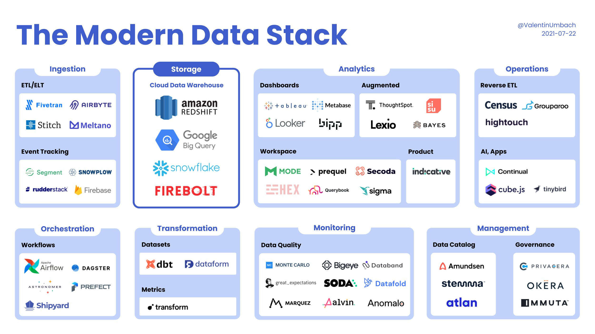
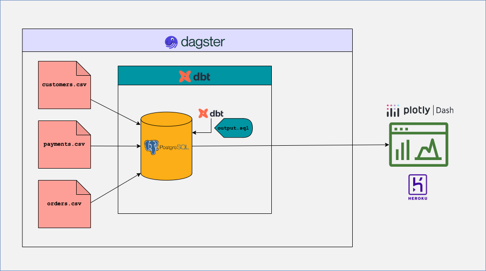

## Introduction
It's one thing to take learn how individual tools work, and quite another to figure out how they fit together. I realised this firsthand after taking a few beginner-intermediate level data engineering courses. I was excited to apply my newfound knowledge to my own project, but quickly ran into a wall. 

Courses present concepts and workflows in a clean and sandboxed way, which is great when you need to follow along and replicate the exact same instructions. But this makes it hard to map even basic concepts to your entirely novel project on your local machine.

If you've ever felt this way, I wrote this for you. We will go over things that are usually glossed over but absolutely critical when running a full end-to-end data science or data engineering workflow. things like .yaml files, bash, and database schemas. 99% of tutorials online assume you know *why* something matters or how it fits in with everything else, so they skip over concepts or steps which can lead to hours of debugging. (Debugging is an important skill to learn, but not when you don't know what you don't know.)

I've chosen to simplify various parts of this project in order to focus on the *full-stack* or *end-to-end* aspect of a data engineering project. Courses tend to go deep into a tool or concept, and not how it all connects to other parts of the data stack or business use case. Learning how things fit together, and the challenges at each step, will also help you avoid overengineering solutions at any individual step. 

The modern data stack has a rich ecosystem of open-source tooling that makes it possible for even Python beginners to build data pipelines and push it to a deployed app fairly quickly.

This is a long tutorial as I want to err on the side of overexplaining. Feel free to reach out via email if you catch any errors or need some help!

## Data engineering vs data science 
reframe it:
blueprint for publishing your first data science app

## The modern data stack
In the simplest terms possible, what we are trying to do here is grab data from a source, dump it into a database, transform it to what we want, and then display it on a web dashboard for easy analysis.

So, we need a database, a transformation tool, an orchestrator to manage the workflow, a visualization platform to create dashboards, and a hosting service to make it all accessible online.

There are lots of options online:

I went with:
* Database: postgreSQL
* Transformation tool: dbt
* Orchestrator: Dagster
* Visualization: Plotly 
* Data app: Plotly Dash
* Hosting: Heroku

## How this all fits together
Each of these tools can do much more than what is described here. For example, postgreSQL can ingest data through batch uploads, streaming, or connectors from other data sources, but our tutorial will focus only on how it ingests .csv files. 

| Step          | Tool/Platform  | Description                                                                                                                                                                                                                                      |
|---------------|----------------|--------------------------------------------------------------------------------------------------------------------------------------------------------------------------------------------------------------------------------------------------|
| **Ingestion** | PostgreSQL     | Data is ingested into the database.                                                                                   |
| **Transformation** | dbt | dbt runs SQL-based transformations on this data and loads the transformed data back into PostgreSQL.                                      |
| **Orchestration**  | Dagster       | Manages the entire workflow, ensuring smooth transitions from ingestion to transformation. Dagster triggers the transformation process where raw data from PostgreSQL is transformed using dbt.                                                    |
| **Visualization**  | Plotly Dash   | An interactive dashboard is created to visualize the transformed data. The Dash app reads data exported from PostgreSQL and presents it in a user-friendly interactive manner.                                                                                   |
| **Deployment**     | Heroku        | The Plotly Dash application is hosted on Heroku, making the dashboard available on the web for users to access and interact with.                                                                                                                |

This tutorial will focus on postgreSQL, dbt, and Plotly Dash. We'll bring in an orchestration tool and cover cloud deployments in the next post. 

## Let's set up your workspace
This section is entirely optional if you're comfortable with your current setup. Here's what I used:
* iTerm:

* VSCode:

* Github repo:

## Packages you'll need

## Ingestion

## Transformation

## Visualization

## Conclusion