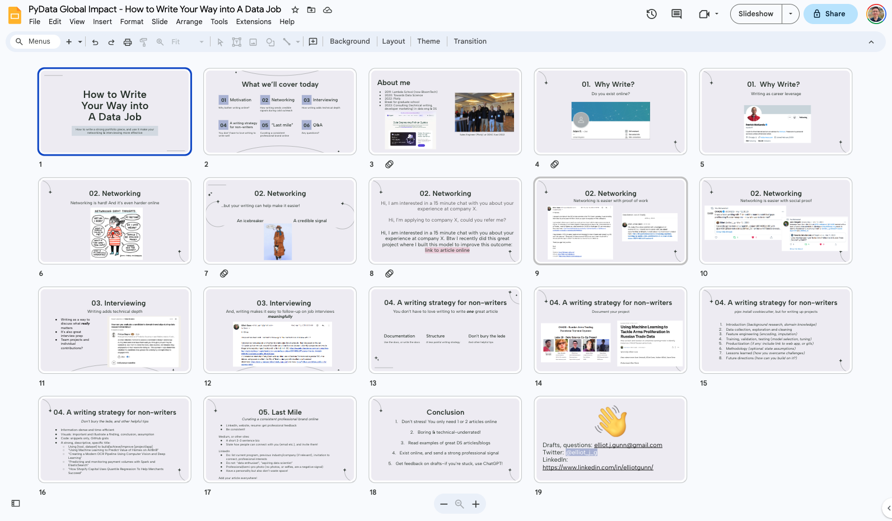

<iframe width="560" height="315" src="https://www.youtube.com/embed/pcYER-FMnPY?si=cWCamdYIWWVHu8Je" title="YouTube video player" frameborder="0" allow="accelerometer; autoplay; clipboard-write; encrypted-media; gyroscope; picture-in-picture; web-share" allowfullscreen></iframe>

 
Sometime back in January 2021 (two years ago!), I sat down and cranked out an article called "How to Write Your Way into a Data Job". Although I never hit publish, it turned into the basis of a talk that I've now given three times (BloomTech, Brave, and most recently PyData's Impact Scholarship Program). The latest iteration of the slides are above. 

I've also since gone through some unexpected career shifts that I could not have foreseen when I first switched into data science back in 2019. I wrote this when I was an editor at Towards Data Science; reading hundreds of articles weekly from beginners and senior practitioners helps build an intuition for really great technical writing. Then I became a sales engineer at Plotly, took a break to fulfil a long-time dream to study economic history at the London School of Economics, and suppported my very costly 8 months in London by freelance technical writing. When I finished school, a series of fortunate networking encounters eventually led me to a full-time technical writing role at Datafold. 

This is to say, it's very strange to look back at a two year old piece of writing and realize that I'm back where I started, except with hopefully more professional credibility to back up my opinions. 

I reworked the structure when I was preparing for PyData--having my proposal accepted felt like it was time to take these ideas seriously. But most of the content did not need much updating because, as you'll see, the principles are pretty basic: work hard at making something good, share it online, and increase your surface area for opportunity. 

Anyway, it's a snowy day in Kingston, and I think it's high time I publish this. With that lengthy introduction, let's get into it!

## Why write online?
Really briefly, here's my case for why you should invest 10 minutes of your life and commit to reading the rest of this post. 

Most of us find it super hard to get started; many great technical projects never get written up at all. There's two reasons:

### Career leverage
If you follow Patrick McKenzie on Twitter (@patio11), he once said that writing is the highest leverage activity you can do for your career (I can't find the exact tweet, but he's been an advocate of writing online for the longest time).

What does this mean? There’s a pretty good chance you will get Googled before an interview. Having polished work online is a great way to signal your technical chops and ability to communicate. 

It also indicates that you are conscientious: you made an effort to present yourself professionally online to your peers. I think this is something that many of us underestimate.

### Barely existing
When I was working at TDS, part of my job required me to screen authors based on their professional credibility. We assess articles not just on whether it’s well-written/meets our guidelines, but also if the authors have any educational or professional credibility to back up what they're saying.

Sometimes it's hard to make a call. Once, when I was going back and forth with a colleague about whether to publish an article, they made a comment that this author “barely seems to exist” online. I thought that was a perfect description for what you don’t want to happen. While existing might not add much to your professional credibility, not existing probably really hurts it. 

## Networking

### Networking is hard! 
Existing online makes networking, online and offline, much easier. Doing cold outreach on LinkedIn or Twitter is part of the job search process. Giving people data points, through your online portfolio, can help increase your cold outreach conversion rate. 

No matter how extroverted you are, it's always tough to initiate new connections. I've gotten better at it, partially through trial-by-fire in my sales engineer role, but it's still hard. And it was really hard when I was first breaking into tech and attending data science conferences and job fairs. 

I found that having my project published online made it a lot easier to network in-person and online.

Think of your writing as doing two things: it’s an icebreaker ("hey I have something to talk about!") and it’s a way to signal proof of work and credibility in your cold outreach. This is particularly important when you do not have much experience. 

### Writing is an icebreaker
When you want to connect with someone online, most people go with some version of:

* Hi, I'm currently a student about to graduate. Would you be available for a 15 minute call about your experience at company X or industry Y? 

* Hi, I’m applying to company X, could you refer me?

As you can probably guess, these aren't great options. I found better succcess with this:

* "Hi, I am interested in a 15 minute chat with you about your experience at company X, btw I recently did this great project where I built this model to improve this outcome: **link**"

The link is really important proof of work that you are legit and have done your homework. They may not actually look it up. It’s not a magic bullet to get you referrals or even a conversation. But the link gives them an option to quickly vet who you are and what you’ve done. 

### Networking examples
I want to share a few examples of what I mean as I think a lot of these “how to network online” resources don’t share in concrete terms what an effective outreach looks like. 

**will include examples**

## Interviewing 

### Writing adds technical depth
Writing allows you to discuss what really matters. You have to understand the entire codebase, all the methodological assumptions, the modeling tradeoffs, and you can easily field questions on all of it. 

This doubles as really great interview prep too: and a handy reference to refresh your memory when there’s been a gap between your last project and your next interview. 

### Group projects and individual contributions
Sometimes, a blocker is being unsure of how to write up a project that you only had a small part to play in. 

The way forward is to take on writing up the whole project. Generally speaking, many technical people don't enjoy writing, so you'll be doing everyone a favour. 

A bigger reason to volunteer as head writer is that the process forces you to understand all the moving parts really well, even parts you didn’t directly contribute to.  

As long as you're clear about which parts you contributed to, and have received permission from the relevant authorities (e.g. company, internship program) to publish it, don't overthink about whether the writing truly showcases your technical abilities (and limits). 

Plus, demonstrating an understanding of how the different pieces fit together also signals incredibly important and rare technical skills. 

## Writing strategy
Now that I've convinced you why and how writing online is really helpful, let's dig into a strategy for success. 

### Use the docs, or write the docs
At BloomTech, our group capstone project documentation was 22 pages long. It was not neatly organized, but it was comprehensive. I was fortunate to be part of a team where each member was interested in writing up the parts of the project that they took the lead on. We were motivated to make it easier for the next group to build on what we had created and take it even further. Hence, we were very motivated to include a lot of detail, and err on the side of excess detail. 

This made it much easier to write up a ~1,000 word blog post on, because you absolutely will forget a lot of details by the time the project ends weeks later. Document everything, even if you think it was a really trivial detail or decision!

That being said, how much detail should you include in the final piece? That depends on your audience or purpose, but in general, you want to **aim for a level of detail that you could interview off on**. 

This forces you to address all the trickier bits now, before you’re caught on the spot in an interview. Even really basic things like, how large was the dataset? Was it already labelled? Why did you choose a gradient boosting classifier? What is a gradient boosting classifier? 

We spend so much time on our projects that we know it inside and out when we're in the thick of things, but months later when you're in an interview, these questions will absolutely come up and you'll want to have a handy reference somewhere to help refresh your memory. 

### pip install writing-outline
Keep it simple: a typical data science project should include the following as headers:
1. Introduction (background research, domain knowledge
2.  Data collection, exploration and cleaning 
3. Feature engineering (encoding, imputation)
4. Training, validation, testing (model selection, tuning)
5. Productization (if any: include link to web app, or gifs)
6. Methodology (optional: state assumptions)
7. Lessons learned (how you overcame challenges)
8. Future directions (how can you build on it?)

### Don’t bury the lede, and other helpful tips

We’re all overwhelmed with a lot of content online these days, you're doing your audeince a favour to get to the point quickly. 

Once you're done writing, write a one sentence summary about what your project accomplished and move that to your introduction. Why? Some recruiters say they only spend 7 seconds on a resume. Assume that your readers are looking for a “so what?” hook to continue. Don’t make them work for it!

A good portfolio article is information-dense and time-efficient. Recruiters, potential employers, and interviewers are faced with many candidates. If they do read your post, you want to make it as easy as possible for them to tick things off on their checklist. Do they approach projects with structure? Can they work in teams? Can they code? This isn’t the time to go into detail about personal anecdotes. 

## Don’t neglect the “last mile”

It's really important to exist online, and exist in a consistent way across online platforms, even if it feels repetitive and boring. 

>Repetition and consistency helps to establish a clear personal signal in a very noisy world. 

**Some things to have:**
* A short 2-3 sentence bio. Have a personality, but don’t waste space!
* List your current program, previous industry/company (if relevant), invitation to connect, professional interests
* Professional/semi-pro photo 
* Share how people can connect with you (email, LinkedIn etc)

**Some things not to have:**
* Include “data enthusiast”, “aspiring data scientist” in your bio (just trust me)
* Not having a photo at all, or having selfies, are a negative

**Make your article easy to finde**
* Once it’s published, don’t hide it! Make it front and centre in your online presence
* Add it to your cold emails, job applications, interview follow-ups, tweets, and LinkedIn bio

## Don't stress! 

I always tell people: you don't need to start and maintain a weekly blog or Substack. You need: one article. Just one! And make it good. 

It sounds crazy but once you start exist online, it sends a strong professional signal that can open up doors and paths you might not have thought possible.

Keep it boring and technical. Make it easy for people to read through and come away with insights. 

We learn best by example: look up great data articles and blogs, and do what they do. 

Try to get feedback on drafts. My inbox is always open, and not enough people take me up on this: elliotjgunn at gmail.com. If you're shy, ask ChatGPT!