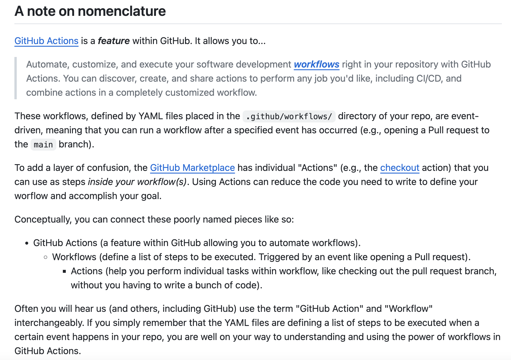

# Technical writers don't need to worry about LLMs 
Days after OpenAI dropped ChatGPT onto the world in November 2022, I signed a freelancing technical writing contract with my first enterprise client. I remember feeling astounded by the hourly billing rate, the most money I had ever made yet in my relatively short tech career, and then wondering how long this would even last before I lost my job to a $20 USD/month LLM subscription. 

I didn’t worry too much at the time since I saw the gig, and others I eventually took on, as a stepping stone towards becoming more technical while I did graduate school in the UK. To write about something well, you have to know a bit about what you’re talking about—and I’ve had to learn new things in each article I’ve written since. 

Exactly a year after that, I had somehow obtained enough different clients to go full-time in November 2023. With each new client, I raised my rate a little more and no one blinked. Eventually, I received an offer to go in-house as an actual, legit, full-time Technical Writer™ in enterprise tech. 

So I took the leap. In my current role, I split my time pretty evenly between my three responsibilities: overseeing our docs, developer marketing, and internal analytics engineering. This is a pretty unique mix for a technical writer, and it’s a credit to Datafold for carving out a space for me to have meaningful hands-on coding opportunities. Being a better coder is essential to good technical writing, and I want to get as close to the customer’s experience as I can in everything I write. 

While I still had concerns about job security, as a good economist, I have long internalized that [prices are signals](https://en.wikipedia.org/wiki/Price_signal). There’s a reason why companies still find it hard to hire good technical writers. I had learnt enough about developer marketing and technical writing, overlapping but still distinct spaces, that I understood why LLMs wouldn’t be taking my job anytime soon. More importantly, I knew that I could add far more value than an LLM can or ever will. 

FWIW, I have not had to persuade clients of my utility. One company I spoke to said they felt a visceral “allergic” reaction when they spotted ChatGPT in developer marketing. Since then, I've been mulling over what exactly LLMs lack relative to a human writer. When [I tweeted about a readme that made me go "woah!"](https://twitter.com/elliot_j_g/status/1746281840539758902) and saw that it resonated with others in data, I figured it was time to sit down and write some thoughts up.  

Here's my case for three things that good technical writing does well: it’s opinionated, surfaces “ghost knowledge”, and makes the underlying context explicit.  

## Experts have opinions
We don’t just want to learn how to do something. We want to know if it’s the better, or worse, way of doing it, and why. 

This is why content built around “best practices” performs so well. Knowing which path to take, and when to take it, is hard won through experience. LLMs can only list paths, and they’ll list as many as you want them too. 

This is also why it’s still really hard to create white papers and tutorials that add value. Technical writers must lead from their own experience, or borrow someone else’s through interviews. 

The interesting thing about this is that your opinions don’t have to be right to have an impact. Just the act of making a case for your ideas produces professional trust in that you, too, are in the trenches trying to chip away at a shared problem, and not some growth hack trying to SEO optimize another tutorial-listicle. 

## Surfacing ghost knowledge
Vicki Boykis first wrote about [ghost or implicit knowledge](https://vickiboykis.com/2021/03/26/the-ghosts-in-the-data/) in data, which is basically about how a lot of useful technical knowledge is really only accessible by interacting directly with experts. A good example is learning through pair-programming: the few times I’ve been fortunate enough to watch an engineer at work via screen sharing, or have them watch me fumble through a task, led to pretty big improvements in my workflows. 

You not only get to see them apply new knowledge, but their mental models for approaching a problem, and how they debug errors. I have not found textbooks or courses to be anywhere good substitutes for learning implicit knowledge. 

There are practitioners who are slowly making knowledge more accessible in their domains: 
* [Simon Späti on data engineering](https://www.ssp.sh/categories/data-engineering/)
* [Laszlo Sragner’s on doing machine learning](https://laszlo.substack.com/about)
* [Eugene Yan on machine learning systems](https://eugeneyan.com/)
* [Chip Huyen on MLOps](https://huyenchip.com/)
* [Shreya Shankar on ML engineering](https://www.sh-reya.com/blog)
* [Randy Au on quant UX](https://www.counting-stuff.com/) (his recent [PyData talk](https://www.youtube.com/watch?v=-IOB2wiwloI) on the tradeoffs between “doing the work and thinking about the work” is a great example of [making mental models](https://jamesclear.com/mental-models#:~:text=The%20phrase%20%E2%80%9Cmental%20model%E2%80%9D%20is,understand%20how%20the%20economy%20works.) explicit)
* and of course, [Vicki Boykis on data science](https://vickiboykis.com/)

When I worked at Towards Data Science, I pitched several new columns, including the [Notes from Industry](https://towardsdatascience.com/tagged/notes-from-industry), to flag content written by data science practitioners that talked about what data science actually looked like in practice. 

It’s not just blogs; I used to [watch Mark Saroufim code through learning new concepts](https://www.youtube.com/@marksaroufim/videos), and was a fan of a game-show style data science competition called SLICED where you could see data professionals work on their solutions live ([Season 1 still lives here!](https://www.youtube.com/playlist?list=PL6PX3YIZuHhyQmXKnyZmVDzdgAYbzwgDw)). 

On the enterprise marketing side of things, Tim Castillo’s post on [how Dagster uses their own orchestration tool to run their internal analytics](https://dagster.io/blog/how-dagster-labs-runs-dagster) is a great example of teaching by showcasing. Tim drills down to details such as:

> At Dagster Labs, we've found ourselves constantly writing logic to decide what database or S3 bucket to read and write from. This is why we have a set of helpers that not only figure out which environment Dagster is currently running in, but also what to do if in a specific environment.

Imagine you're a startup trying to set up your data engineering infrastructure from scratch, and you want to do it right. Maybe you'll go with the data orchestration company that is open about how it handles similar decisions. 

One of my 2024 goals is to get more opportunities to learn directly from experts, whether through pair-programming sessions, code reviews, or collaborating on projects to absorb new and better ways of doing things. 

## Context is scarce
Many tutorials are standalone and laser focused on achieving a very specific and narrow outcome. This is good because it makes learning new things straightforward, but really good tutorials consider how people learn, and anticipate questions or problems.

People don’t always follow a linear path when learning. We reach step three, find that a concept or tool is new, open a browser window to learn more, and then try to implement a slightly different version based on what we find to be better for our use case. 

The shorter the tutorial relative to the complexity of material presented, the worse the learning experience. For example, I’ve been working through this “[GitHub Actions in 15 minute tops](https://laszlo.substack.com/p/cq4ds-python-project-from-scratch?utm_source=post-email-title&publication_id=61101&post_id=135682453&isFreemail=true)” tutorial from one of my favorite practitioner-led newsletters. It’s heavy on code snippets and light on explanations. I found myself asking why a lot, and considering whether each suggested tool was a best practice or if I could substitute another tool instead. 

## An example: SQLFluff & CI/CD

Recently, while trying to teach myself CI/CD by building my first GitHub Actions workflow, I ran into [SQLFluff’s Github Actions readme](https://github.com/sqlfluff/sqlfluff-github-actions/tree/main). SQLFluff is a linter (enforces code format consistency, catches errors etc), and the ReadMe had this very interesting bit:

This was more useful than a lot of the tutorials I encountered on GitHub Actions. The author took the trouble to explain the overarching concept because they knew:
* from experience (point #1)
* that it was important to make ghost knowledge accessible (point 2)
* and expanded on the repo’s purpose, which was to make it easy to setup SQLFluff in GitHub Actions via various quickstart templates, to discuss important context (point 3) about “the power of workflows in GitHub Actions” 

## Towards technical writing excellence 

I think I’ve made a pretty good case for what makes technical writing good. But I’m just getting started and want to continue building on what makes technical writing great. 

If you have any favourite ReadMes, docs, newsletters, or other ways of learning new things, please reach out! 
