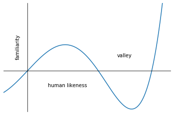

## Some random little snippets of code written for very niche uses

- Recreating the Masahiro Mori's Uncanny Valley graph using NumPy and Matplotlib. The challenge: how do you recreate the general shape of a graph without data or the equation? I found a similar looking polynomial function from [here](http://mathonweb.com/help_ebook/html/functions_4.htm), tweaked the equation till it was a much closer match, then did some major formatting in Matplotlib. Google Colab notebook [here](https://colab.research.google.com/drive/1sqcw8ub80hADI1KjznAz0PhMDKtD2HIp). 

